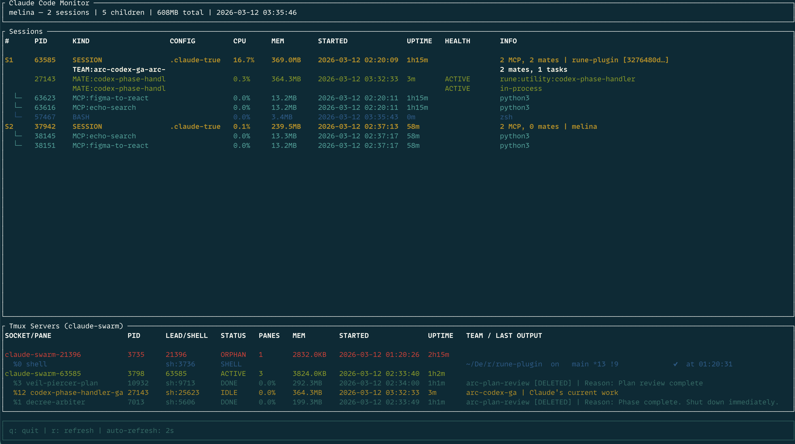

# melina

A fast, native process monitor for [Claude Code](https://docs.anthropic.com/en/docs/claude-code). Track sessions, agent teams, MCP servers, tmux swarms, and orphans — all from your terminal.



## Features

- **Session discovery** — finds all running Claude Code processes and builds parent-child trees
- **Child classification** — identifies MCP servers, teammates, hooks, and bash tool invocations
- **Team monitoring** — reads `.claude/` config to show agent teams, members, and task counts
- **Health checks** — detects zombie teams (dead owner), stale/stuck teammates, orphan tmux servers
- **Tmux swarm support** — monitors `claude-swarm` tmux servers with per-pane agent details
- **Resource tracking** — CPU%, memory, uptime, and start time for every process
- **Kill tools** — safely terminate Claude processes, clean up zombie teams and orphan servers
- **Two interfaces** — one-shot CLI with watch mode, and an interactive TUI dashboard

## Install

Requires Rust 1.85+ (edition 2024).

```bash
git clone https://github.com/vinhnx/melina.git
cd melina
make install    # builds release + symlinks to /usr/local/bin
```

Or build manually:

```bash
cargo build --release
# Binaries at target/release/melina and target/release/melina-tui
```

## Usage

### CLI

```bash
melina                        # One-shot snapshot
melina --watch 2              # Live refresh every 2 seconds
melina --json                 # JSON output (pipe to jq, etc.)
melina --json --teams         # Include team details in JSON
melina --orphans              # Show orphan processes only
melina --kill-zombies         # Clean up dead teams + orphan tmux servers
melina --kill 12345           # Kill a specific Claude process by PID
melina --kill 12345 --kill 67890  # Kill multiple PIDs
```

### TUI Dashboard

```bash
melina-tui
```

| Key | Action |
|-----|--------|
| `q` / `Esc` | Quit |
| `r` | Force refresh |

Auto-refreshes every 2 seconds. Shows sessions, child processes, agent teams with health status, and tmux servers in a tabular layout.

## Project Structure

```
crates/
  melina-core/    Core library — process discovery, classification, health checks
  melina-cli/     CLI binary — snapshots, watch mode, JSON, kill commands
  melina-tui/     TUI binary — interactive ratatui dashboard
```

## License

MIT
